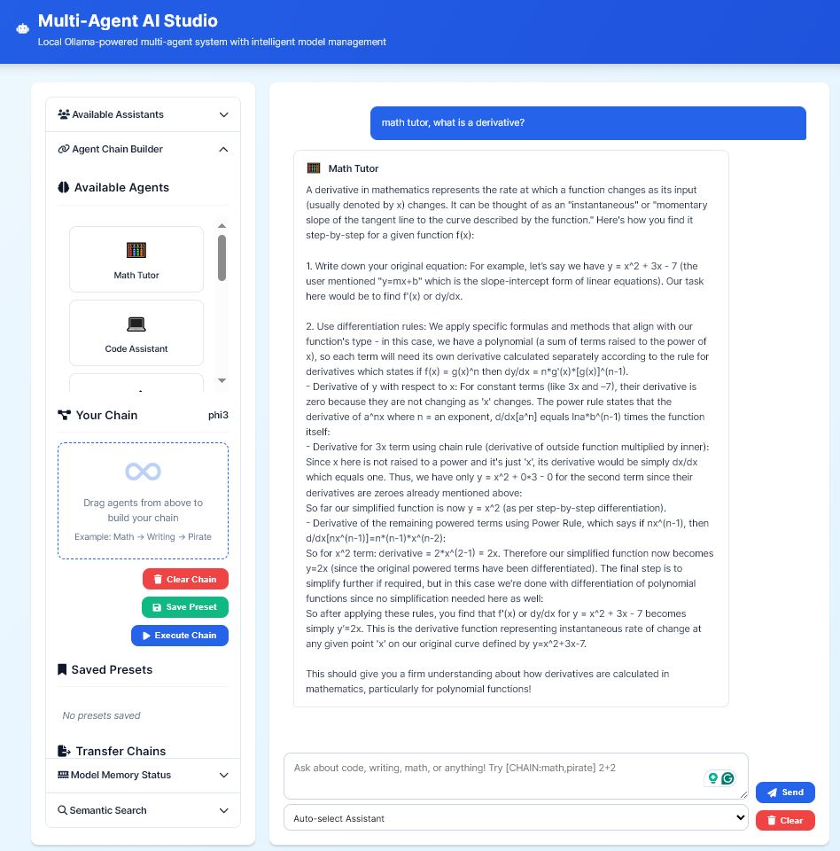
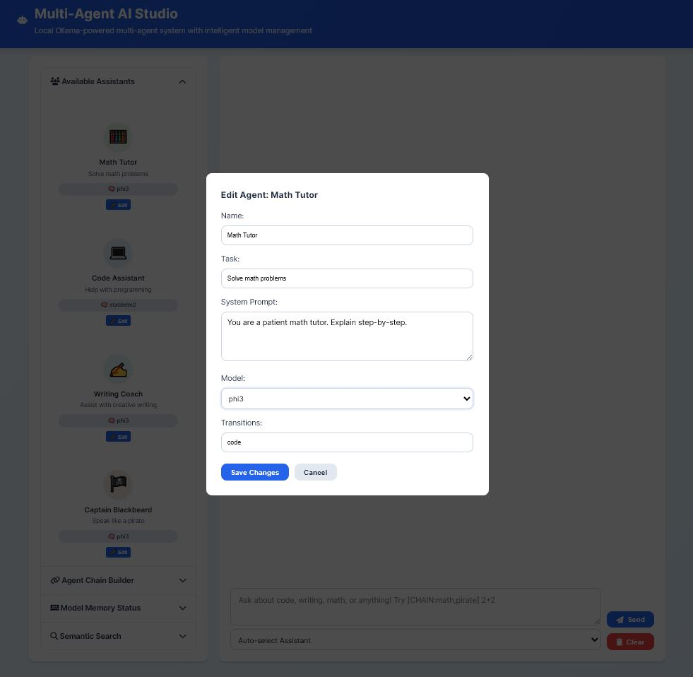

# Simple Multi-Agent Framework

<p align="center">
  
</p>

A lightweight, local-first **multi-agent AI chat system** built with **FastAPI** and **Ollama**.  
Create multiple AI agents with memory, reasoning, and collaboration — fully offline.

---

##  Features
-  Multi-agent chat with memory  
-  FastAPI backend + ChromaDB persistence  
-  Ollama local LLM integration (Phi-3, Mistral, Gemma2, Qwen, etc.)  
-  Offline & open-source  
-  Simple HTML/CSS frontend  

---

## Screenshots
<p align="center">
  
  
</p>

---

## Quick Start

```bash
# Clone repo
git clone https://github.com/Entendore/SimpleMultiAgentFramework.git
cd SimpleMultiAgentFramework

# Install dependencies
pip install -r requirements.txt

# Install Ollama & models
ollama pull phi3
ollama pull gemma2

# Run the app
python app.py
